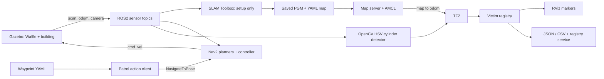

# Design: Search-and-Rescue Marker Finder

## Architecture

## Coordinate chain

The wheel plugin publishes `odom -> base_footprint`. Robot State Publisher reads
the bundled Waffle URDF and publishes the fixed sensor transforms. SLAM Toolbox
provides `map -> odom` during setup; AMCL provides it during the saved-map mission.
They are never started together.

The full chain is `map -> odom -> base_footprint -> base_link -> camera_link ->
camera_rgb_frame -> camera_rgb_optical_frame`. Optical coordinates use x right,
y down, and z forward. The camera plugin explicitly stamps both images and
CameraInfo with that optical frame. TF2 looks up the transform at the image's
timestamp; missing transforms cause the observation to be skipped, not guessed.

## Perception

Two HSV intervals isolate red, including its wraparound at hue zero. Morphological
opening suppresses isolated pixels. Area and aspect checks reject small or implausible
contours. Horizontal clipping invalidates a measurement because both silhouette
edges are required. The known cylinder radius is 0.13 m.

For horizontal bounding-box edges uL/uR and focal length fx, the tangent angles are
`a = atan((uL-cx)/fx)` and `b = atan((uR-cx)/fx)`. The centre bearing is `(a+b)/2`;
horizontal range is `radius/sin((b-a)/2)`. The resulting optical x/z and projected
vertical midpoint form a PointStamped transformed into map coordinates. The node
uses live CameraInfo; the supplied calibration YAML documents the same ideal
Gazebo camera. This is classical RGB geometry, not depth or world ground truth.

## Registry

Color cylinders have no intrinsic numeric ID. The detector sends anonymous
observations (`id=0`); the registry assigns stable IDs by discovery order. New
positions within 0.45 m of an existing centroid update that centroid by a running
mean. Three observations are required before the track becomes visible in the
service, exported results, or RViz. Positive source IDs are also supported and
associated consistently; nearby detections from different IDs still merge.
NaN, infinity, and invalid confidence values are rejected. Tracks reset with a
new registry process; exported files are not silently reloaded into a new run.

## Navigation and mapping

The four rooms share a wide central opening. A setup-only, odometry-controlled
survey and LiDAR obstacle stop collect a real SLAM map. The mission separately
starts AMCL, Nav2 lifecycle managers, planner, controller, behavior server and
velocity smoother. A Python Simple Commander client submits eight configured
goals, waits for actual action results, and records failures and timeouts.
No direct wheel commands are used during the mission.

## Tradeoffs and limits

- Known-size red cylinders are the permitted simpler alternative to ArUco IDs.
  Occlusion, merged silhouettes, unrelated red objects, and wrong cylinder sizes
  can produce missed or biased detections. This is a controlled simulation.
- Centroid clustering assumes distinct victims are farther apart than 0.45 m.
  Repeated frames are confirmation, not statistically independent evidence.
- A deterministic survey is appropriate for this supplied building; it is not
  general autonomous exploration. Unexpected obstacles stop it with an error.
- The reference occupancy grid is generated from geometry for comparison only.
  The mission map must be saved from SLAM. The previous placeholder is labelled.
- Gazebo Classic is required by the specification. The amd64 container uses
  emulation on Apple Silicon; software camera rendering may be slow.
- Runtime functionality is not claimed until the real-run verifier passes.
